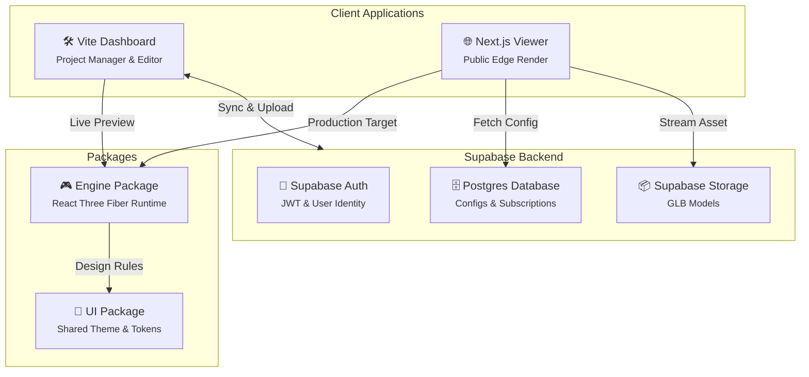

<div align="center">

# 🌍 Venture

### Config-Driven 3D Portfolio SaaS & Interactive WebGL Engine

A professional-grade 3D engine to visualize, customize, and deploy interactive WebGL environments with dynamic configuration.

[](https://venture3d.app/)
[](#)


</div>

---

## 📖 Summary

**Venture** is a multi-tenant, config-driven 3D SaaS platform designed for creators, designers, and agencies to easily manage and publish interactive 3D portfolios. Available through a powerful **Dashboard Editor** and a high-performance **Next.js Public Viewer**.

Unlike traditional hardcoded 3D experiences, Venture implements a **Frozen Engine Contract**, ensuring the rendering core accepts a versioned JSON configuration. This empowers users to upload custom `.glb` models, define interactive behaviors (like wobbly animations, specific highlights, and audio triggers), and tweak lighting and themes without any coding.

Backed by a Turborepo architecture sharing the core `Engine` package between the editing suite and the highly optimized public edge viewer.

---

## ✨ Features

### 🎮 Core Engine Capabilities
| Feature | Description |
|---|---|
| **Config-Driven Runtime** | Engine accepts `type EngineProps = { modelUrl, config, plan }` for full dynamic execution. |
| **Stable Mesh Normalization** | Intelligently re-maps arbitrary Blender object names to stable collision-free IDs (`cube__1`). |
| **Interactive Behaviors** | Click & hover triggers, wobbly animations, piano key presses, and floating geometries. |
| **Atmospheric Systems** | Time-of-day lighting, seasonal themes, dynamic weather, and canvas-based dust motes. |

### 🛠 Architecture & Management
| Feature | Description |
|---|---|
| **Turborepo Monorepo** | Segmented architecture (`apps/dashboard`, `apps/viewer`, `packages/engine`, `packages/ui`). |
| **Dynamic Config Versioning** | Built-in continuous migration layer ensures old user configs are upgraded dynamically. |
| **Live Inline Preview** | Real-time WebGL rendering inside the Dashboard while managing the scene logic. |

### 🔐 Platform Capabilities
| Feature | Description |
|---|---|
| **Supabase Architecture** | Secure cloud configuration persistence with `users` and `projects` tables. |
| **Tiered Pricing Model** | Plan-gated engine features via Stripe webhooks restricting usage for free users. |
| **High Performance** | Instanced mesh optimizations, hoisted material references, and memory-safe physics loops. |

---

## 🏗 Architecture



---

## 🛠 Tech Stack

| Layer | Technology | Purpose |
|---|---|---|
| **Frontend Setup** | Turborepo, NPM Workspaces | Streamlined monorepo structure |
| **Render Engine** | React Three Fiber (R3F), Drei | Main 3D abstractions and helpers |
| **Dashboard** | React 18, Vite | High-performance SPA & editor logic |
| **Public Viewer** | Next.js 14 | Edge-cached SEO-friendly dynamic rendering |
| **Styling** | Vanilla CSS, Core UI Package | Isolated rendering and UI boundaries |
| **Backend/Auth** | Supabase Postgres | Authentication, config states, model hosting |
| **Payments** | Stripe | Tiered subscription (Free, Starter, Pro) tracking |

---

## 📂 Project Structure

```text
Venture/
│
├── apps/                               # ─── Consuming Applications ───
│   ├── dashboard/                      # Vite app for users to upload and config assets
│   └── viewer/                         # Next.js app serving the final 3D link to public
│
├── packages/                           # ─── Shared Workspace Libraries ───
│   ├── engine/                         # Core WebGL runtime driven by r3f
│   │   ├── src/scene                   # Object behaviors, lighting, meshes
│   │   └── src/interactionSystem       # Config event handlers, registry, contexts
│   ├── ui/                             # Global theming & visual consistency
│   └── utils/                          # Cross-app tools (API parsers, migrations)
│
├── package.json                        # Root Turborepo orchestration
├── turbo.json                          # Turbo build / pipeline cache definitions
└── index.html                          # Temporary root testing harness
```

---

## 🗄️ Config Validation & Versioning

### Migration Flow Engine
Venture implements a forward-moving config transformation that allows users with older schema definitions to be auto-upgraded inside the viewer, meaning no user project is ever broken by new code.

```javascript
export function migrateConfig(config) {
  switch (config.version) {
    case 1:
      return config
    case 0:
      return {
        version: 1,
        objects: config.objects || {},
        scene: config.scene || {},
        audio: config.audio || {}
      }
    default:
      return config
  }
}
```

---

## 🚀 Getting Started

### 1. Prerequisites
- Node.js 18+
- Supabase Project & Stripe Developer Keys (Optional for local testing)

### 2. Setup
Clone the repository and install workspace dependencies:

```bash
# 1. Clone repository
git clone https://github.com/YumiNoona/Venture.git
cd Venture

# 2. Install all workspaces
npm install
```

### 3. Run Development Server
Leverage Turborepo to run all packages parallel:

```bash
npm run dev
```

---

## 📝 License

[](./LICENSE)

This project is licensed under the **MIT License** — see the [LICENSE](./LICENSE) file for details.
