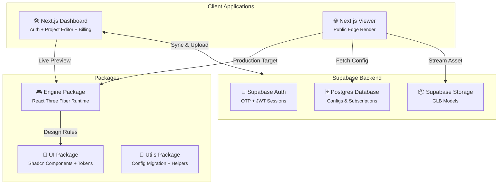

<div align="center">

# 🌍 Venture

### Config-Driven 3D Portfolio SaaS & Interactive WebGL Engine

A professional-grade 3D engine to visualize, customize, and deploy interactive WebGL environments with dynamic configuration.

[](https://venture.venusapp.in/)
[](#)


</div>

---

## 📖 Summary

**Venture** is a multi-tenant, config-driven 3D SaaS platform designed for creators, designers, and agencies to easily manage and publish interactive 3D portfolios. Available through a unified **Next.js 14 Dashboard** with integrated auth, project editing, and a high-performance **Public Viewer**.

Unlike traditional hardcoded 3D experiences, Venture implements a **Frozen Engine Contract**, ensuring the rendering core accepts a versioned JSON configuration. This empowers users to upload custom `.glb` models, define interactive behaviors (like wobbly animations, highlights, and audio triggers), and tweak lighting and themes — all without writing code.

Backed by a Turborepo monorepo sharing the core `Engine` package between the editing suite and the highly optimized public edge viewer.

---

## ✨ Features

### 🎮 Core Engine Capabilities
| Feature | Description |
|---|---|
| **Config-Driven Runtime** | Engine accepts `type EngineProps = { modelUrl, config, plan }` for full dynamic execution. |
| **Stable Mesh Normalization** | Intelligently re-maps arbitrary Blender object names to stable collision-free IDs (`cube__1`). |
| **Interactive Behaviors** | Click & hover triggers, wobbly animations, piano key presses, and floating geometries. |
| **Atmospheric Systems** | Time-of-day lighting, seasonal themes, dynamic weather, and canvas-based dust motes. |

### 🛠 Architecture & Management
| Feature | Description |
|---|---|
| **Turborepo Monorepo** | Segmented architecture (`apps/web`, `apps/viewer`, `packages/engine`, `packages/ui`). |
| **Dynamic Config Versioning** | Built-in continuous migration layer ensures old user configs are upgraded dynamically. |
| **Live Inline Preview** | Real-time WebGL rendering inside the Dashboard while managing the scene logic. |

### 🔐 Platform Capabilities
| Feature | Description |
|---|---|
| **Supabase SSR Auth** | Passwordless email OTP login with server/browser client split and middleware protection. |
| **Tiered Pricing Model** | Plan-gated engine features via Stripe webhooks restricting usage for free users. |
| **High Performance** | Instanced mesh optimizations, hoisted material references, and memory-safe physics loops. |

---

## 🏗 Architecture



---

## 🛠 Tech Stack

| Layer | Technology | Purpose |
|---|---|---|
| **Frontend Setup** | Turborepo, NPM Workspaces | Streamlined monorepo structure |
| **Render Engine** | React Three Fiber (R3F), Drei | Main 3D abstractions and helpers |
| **Dashboard** | Next.js 14 (App Router) | Unified auth, editor, and billing |
| **Public Viewer** | Next.js 14 | Edge-cached SEO-friendly dynamic rendering |
| **UI Components** | Tailwind CSS, Shadcn UI | Premium dark-mode first design system |
| **Auth** | Supabase SSR (`@supabase/ssr`) | Passwordless OTP, server/browser split |
| **Backend** | Supabase Postgres | Config persistence, user management |
| **Payments** | Stripe | Tiered subscription (Free, Pro, Elite) |

---

## 📂 Project Structure

```text
Venture/
│
├── apps/                               # ─── Consuming Applications ───
│   ├── web/                            # Next.js 14 — Dashboard + Auth (UNIFIED)
│   │   ├── app/
│   │   │   ├── (auth)/                 # Login & signup (route group)
│   │   │   │   ├── login/
│   │   │   │   └── signup/
│   │   │   ├── (dashboard)/            # Protected dashboard (route group)
│   │   │   │   ├── projects/           # 3D project editor + live preview
│   │   │   │   ├── settings/           # Profile & slug management
│   │   │   │   └── billing/            # Plan selection (Free/Pro/Elite)
│   │   │   ├── auth/callback/          # Supabase OTP callback handler
│   │   │   └── page.tsx                # Public landing page
│   │   ├── lib/
│   │   │   ├── supabaseClient.ts       # Browser Supabase client
│   │   │   ├── supabaseServer.ts       # Server Supabase client
│   │   │   └── getUser.ts             # Server-safe session helper
│   │   └── middleware.ts               # Route protection
│   └── viewer/                         # Next.js — Public 3D viewer
│
├── packages/                           # ─── Shared Workspace Libraries ───
│   ├── engine/                         # Core WebGL runtime (R3F)
│   │   ├── src/scene/                  # Object behaviors, lighting, meshes
│   │   └── src/interactionSystem/      # Config event handlers, registry
│   ├── ui/                             # Shared UI primitives
│   └── utils/                          # Config migration, Supabase helpers, Stripe
│
├── package.json                        # Root Turborepo orchestration
└── turbo.json                          # Turbo build / pipeline cache definitions
```

---

## 🚀 Getting Started

### 1. Prerequisites
- Node.js 18+
- Supabase Project & Stripe Developer Keys (optional for local testing)

### 2. Setup
```bash
# Clone repository
git clone https://github.com/YumiNoona/Venture.git
cd Venture

# Install all workspaces
npm install
```

### 3. Environment Variables
Create `apps/web/.env.local`:
```env
NEXT_PUBLIC_SUPABASE_URL=your_supabase_url
NEXT_PUBLIC_SUPABASE_ANON_KEY=your_anon_key
NEXT_PUBLIC_SITE_URL=http://localhost:3000
```

### 4. Run Development Server
```bash
npm run dev
```

This starts all apps in parallel via Turborepo:
- **Dashboard**: `http://localhost:3000`
- **Viewer**: `http://localhost:3001`

---

## 📝 License

[](./LICENSE)

This project is licensed under the **MIT License** — see the [LICENSE](./LICENSE) file for details.
